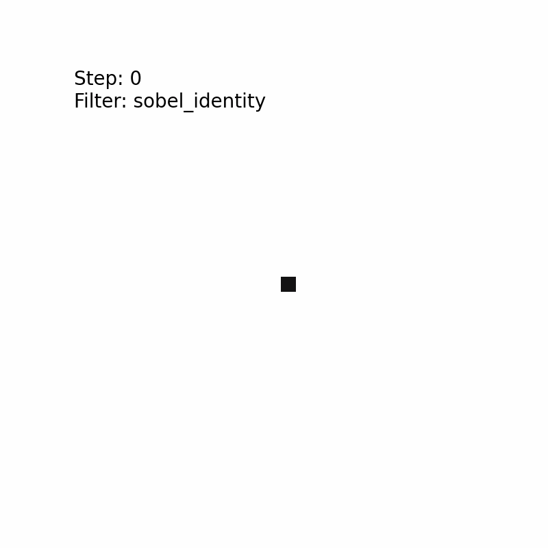
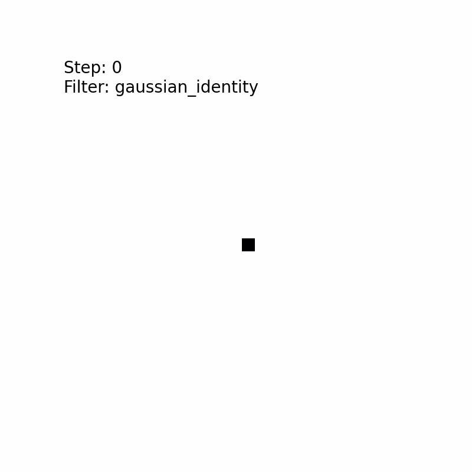
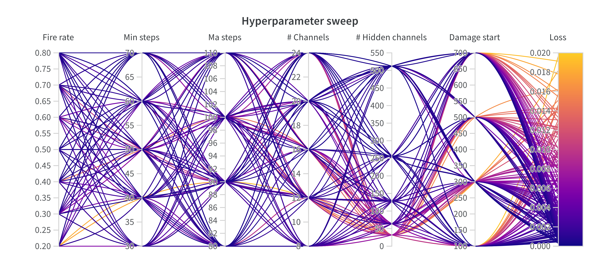

<h1 align="center">Neural Cellular Automata for Medical Imaging</h1>
<br />
<div align="center">
  <a href="https://github.com/Marlon154/DGM-Project-NCA/blob/main/data/bloodmnist/28-test-0.png">
    
  </a>
  &nbsp;
  <a href="https://github.com/Marlon154/DGM-Project-NCA/blob/main/figures/blood-28/28-_mse_sobel_identity.gif">
    
  </a>
  &nbsp;
  <a href="https://github.com/Marlon154/DGM-Project-NCA/blob/main/figures/blood-28/28-_mse_gaussian_identity.gif">
    
  </a>
  &nbsp;
  <a href="https://github.com/Marlon154/DGM-Project-NCA/blob/main/figures/blood-28/28-_mse_laplacian_identity.gif">
    
  </a>
</div>

### General Information
Neural cellular automata (NCA) represent a remarkable fusion of neural networks and cellular automata, enabling the simulation of complex systems and showcasing fascinating emergent behavior. In this project, we investigated their capabilities in the field of medical imaging. Specifically, we train NCA models on the [MedMNIST dataset](https://medmnist.com). Our implementation is based on the code in the paper [Growing Neural Cellular Automata](https://distill.pub/2020/growing-ca/). We provide code for training NCA models using different filter and loss functions, visualizing the dynamic creation of an image based on a pre-trained model, and investigating the influence of various hyperparameters.


### Get started
#### Step 1: Clone the repo
```
$ git clone https://github.com/Marlon154/DGM-Project-NCA.git
$ cd DGM-Project_NCA
```

#### Step 2: Build Docker image
```
docker build -f Dockerfile -t dgm .
```


### Train
To train an NCA model, run the docker image you just built:
```
docker run -it dgm
```
The ```config.yaml``` allows you to set various hyperparameters, including which filters and losses to use. The following are available:

Filters: [```sobel```, ```laplacian```, ```gaussian```, ```sobel_identity```] + ```_identity``` <br />
Losses: ```mse```, ```manhattan```, ```hinge```, ```ssim```, ```combined_ssim_l1```

Our investigation showed that all of our filters only work well in combination with the identity filter. Therefore, when, for example, using the Sobel filter, append the string "_identity" in the hyperparameter settings (e.g., "sobel_identity"). The resulting model will be saved in the ```models/``` folder. 


### Visualization
To visualize the creation of an image, run the ```create_all_gifs.py``` file. This will create a GIF for each model in your ```model/``` folder.


### Hyperparameter sweep
Additionally, we provide code for conducting a hyperparameter sweep, which allows an investigation into which hyperparameters are most important and what values work best. We use the sweep protocol provided by [wandb](https://docs.wandb.ai/guides/sweeps). To conduct a hyperparameter sweep, run the ```hyperparameter_tuning.py``` file. To allow additional supervision on the parameters included in the sweep we provided a ```sweep_config.yaml``` file. Following, you can see an example visualization of a sweep:
<br />
<div align="center">
  <a href="https://github.com/Marlon154/DGM-Project-NCA/blob/main/figures_readme/example_sweep.png">
    
  </a>
</div>


### Download images
You can use the script `download_images.py` in the `src` folder to download the images.
The script requires a file with the images' URLs to download.
The ca{{ should have the following format:

```
python src/download_images.py bloodmnist --size 28 --split test --index 0
```

Possible datasets:
'pathmnist', 'chestmnist', 'dermamnist', 'octmnist', 'pneumoniamnist', 'retinamnist', 'breastmnist', 'bloodmnist', 'tissuemnist', 'organamnist', 'organcmnist', 'organsmnist'


### Poster
For the final presentation, we created a scientific poster summarizing our work, which can be seen here: [Poster](https://github.com/Marlon154/DGM-Project-NCA/blob/main/figures_readme/DGM_NCA_Poster-4.pdf)
